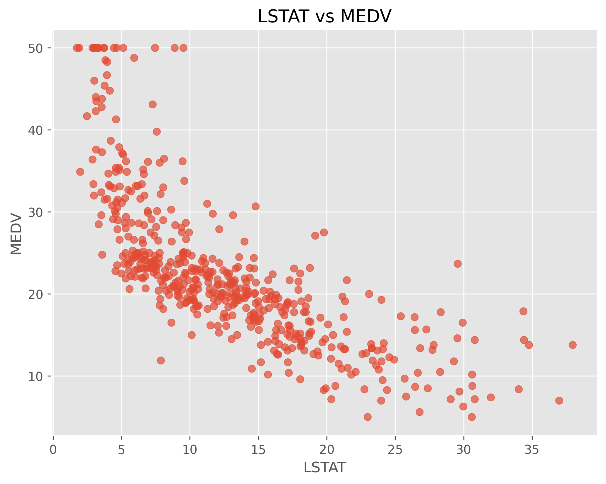
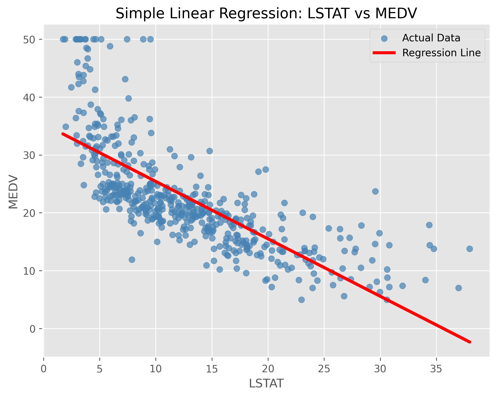
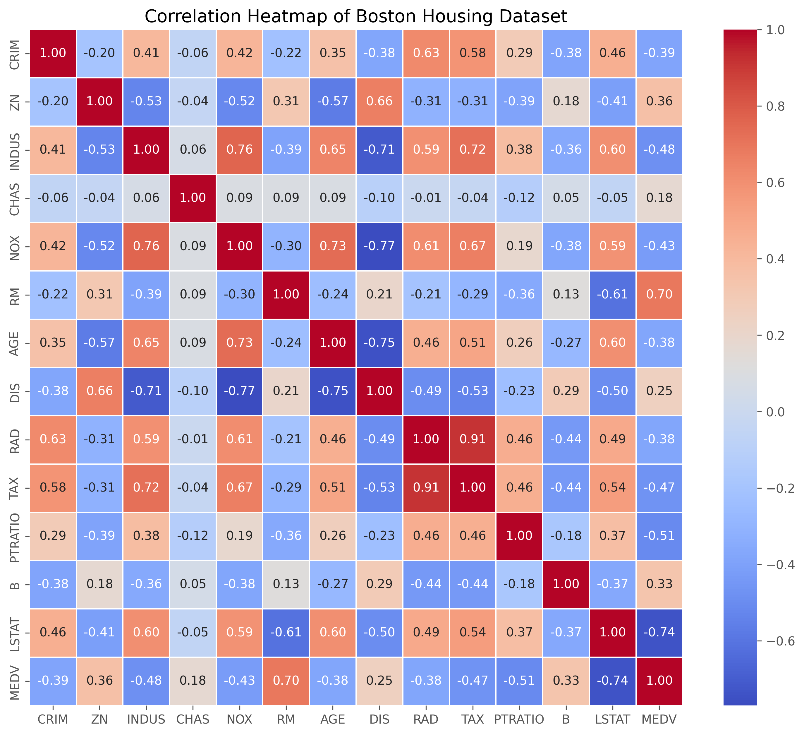
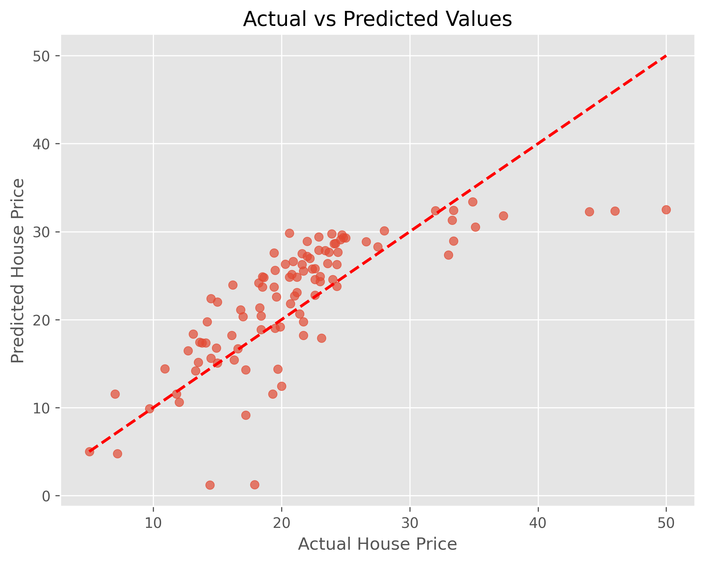
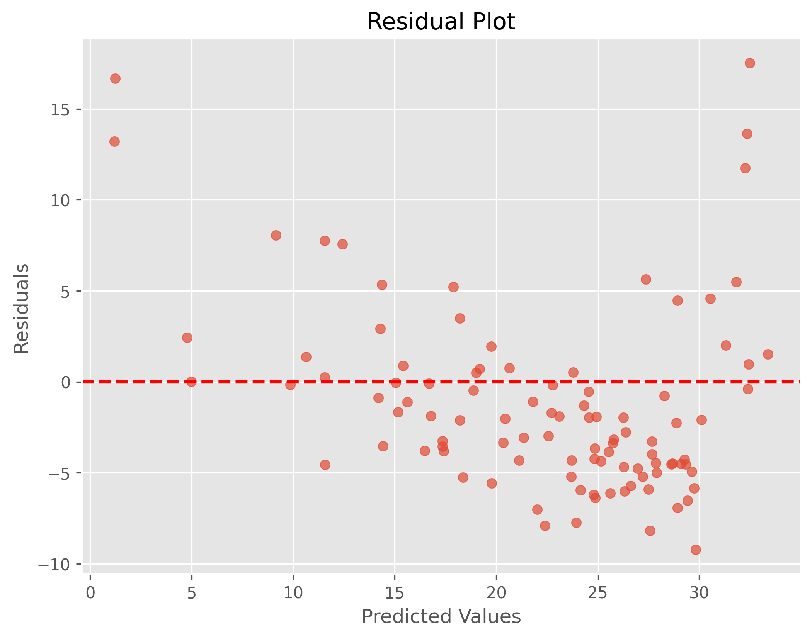
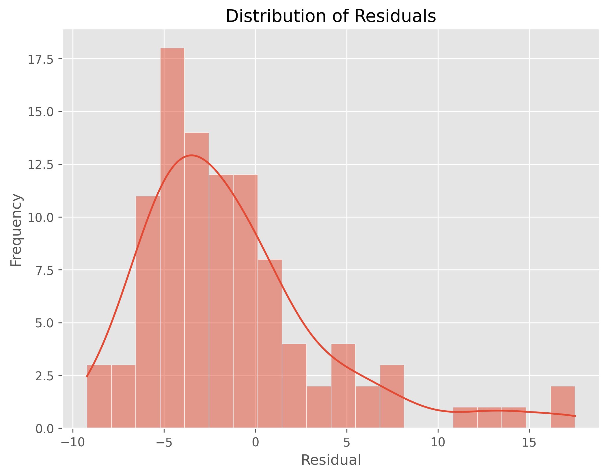

# Level 1 - Task 2: House Price Prediction Using Linear Regression

**Codveda Technologies Machine Learning Internship**

A Linear Regression model built with Scikit-learn to predict house prices based on housing features.

## Project Overview

This project implements an end-to-end machine learning regression pipeline, including data loading, exploratory data analysis (EDA), feature preprocessing, model training, prediction, and performance evaluation using Linear Regression.

**Dataset:** Boston Housing Dataset (or your dataset name if different) — containing housing attributes such as crime rate, number of rooms, tax rate, and other socioeconomic features used to predict median house prices.

## Model Architecture

| Component | Description |
|---|---|
| Algorithm | Linear Regression |
| Problem Type | Regression |
| Input | Housing features |
| Output | Predicted house price |
| Train-Test Split | 80% Training / 20% Testing |
| Library | Scikit-learn |

## Results

| Metric | Score |
|---|---|
| Mean Absolute Error (MAE) | **YOUR VALUE** |
| Mean Squared Error (MSE) | **YOUR VALUE** |
| Root Mean Squared Error (RMSE) | **YOUR VALUE** |
| R² Score | **YOUR VALUE** |

The Linear Regression model successfully learned the relationship between the housing features and house prices. Model performance was evaluated using common regression metrics, with the R² Score indicating how well the model explained the variance in housing prices.

## Visualizations

| | |
|---|---|
|  |  |
|  |  |
|  |  |

## Key Takeaways

- Linear Regression provides a simple yet effective baseline model for predicting continuous values.
- Correlation analysis helps identify the most influential features affecting house prices.
- Residual analysis is useful for checking model assumptions and identifying prediction errors.
- This project demonstrates the complete machine learning workflow, from preprocessing to model evaluation.

## Tools & Libraries

Python · Pandas · NumPy · Matplotlib · Seaborn · Scikit-learn

## How to Run

1. Open `Level1_Task2_LinearRegression_BostonHousing.ipynb` in Google Colab.
2. Run all cells from top to bottom.
3. The notebook automatically trains the Linear Regression model, evaluates its performance, and saves the generated visualizations to the `outputs/` folder.

---

## Author

**Lady Jean Y. Geverola**

BS Data Science  
University of the Philippines Mindanao
